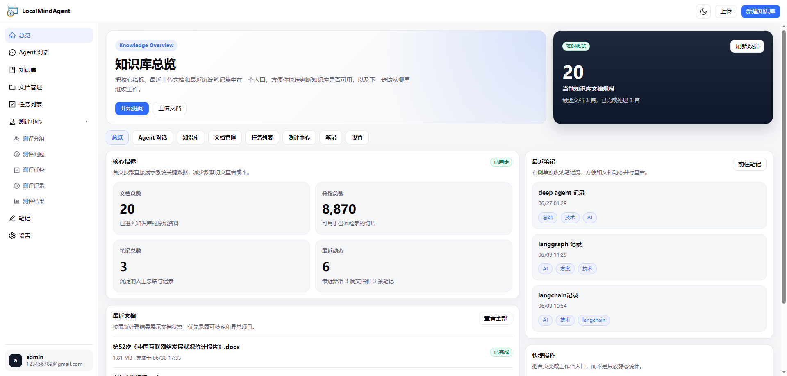

# LMindAgent

基于 RAG（检索增强生成）的个人知识库智能 Agent。
上传私有文档，用自然语言提问，获得带来源引用的可靠回答。

## 页面




## 项目结构

```
LMindAgent/
├── backend/    # FastAPI + LangChain + langgraph + PostgreSQL + pgvector + Redis
├── frontend/   # React + TypeScript + Vite + Ant Design
└── docs/       # 架构设计文档和UI HTML文件
```

## 文档

- [前端说明文档](frontend/README.md) — 前端架构、环境配置
- [后端说明文档](backend/README.md) — 后端架构、环境配置、API 文档、Docker 部署
- [后端架构设计](docs/backend_architecture_design.md)
- [前端架构设计](docs/frontend_architecture_design.md)

## 快速开始

### 后端

```bash
cd backend
cp .env.example .env        # 编辑配置

uv add -r requirements.txt
uv run main.py              # 启动 API 服务 http://localhost:8000
uv run doc_worker.py        # 启动文档处理 Worker（另开终端）
uv run evaluation_worker.py # 启动评估 Worker（另开终端）
```

### 前端

```bash
cd frontend
npm install
npm run dev            # 启动 http://localhost:3000
```

### Docker

```bash
cd backend
docker compose up -d   # 一键启动全部服务
```

## 技术栈

| 层 | 技术 |
| --- | --- |
| 后端 | FastAPI + LangChain + PostgreSQL + pgvector + Redis |
| 前端 | React + TypeScript + Vite + Ant Design |


## 不足
项目还是有很多不足，有待优化和改进


## License

MIT
