# LMindAgent Frontend

基于知识库的智能问答（RAG）系统管理后台，提供知识库管理、文档处理、Agent 对话、RAG 质量评估等功能的可视化操作界面。

## 界面预览

| 仪表盘 | Agent 对话 |
|--------|------------|
|  | 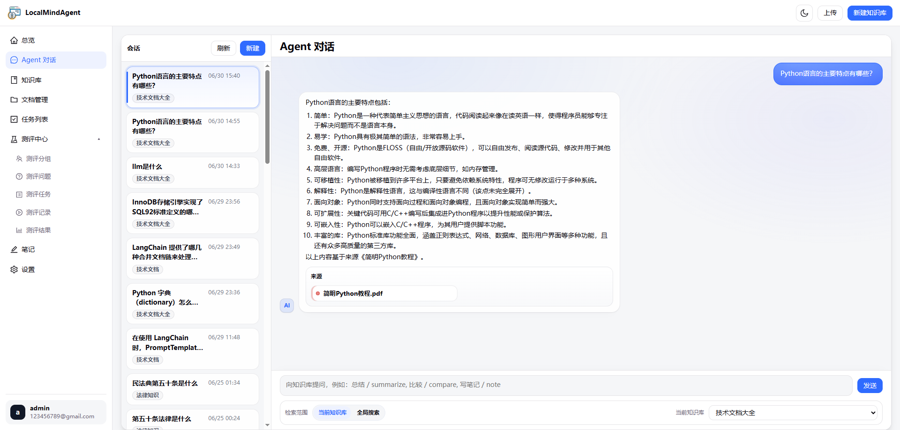 |

| 知识库管理 | 文档管理 |
|------------|----------|
| 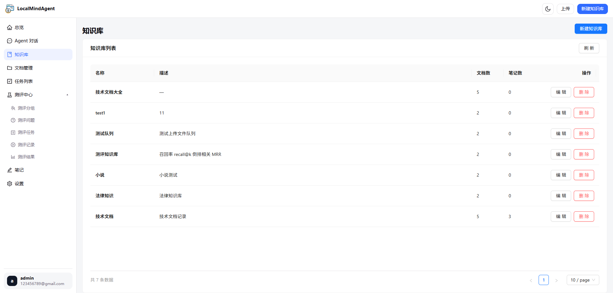 | 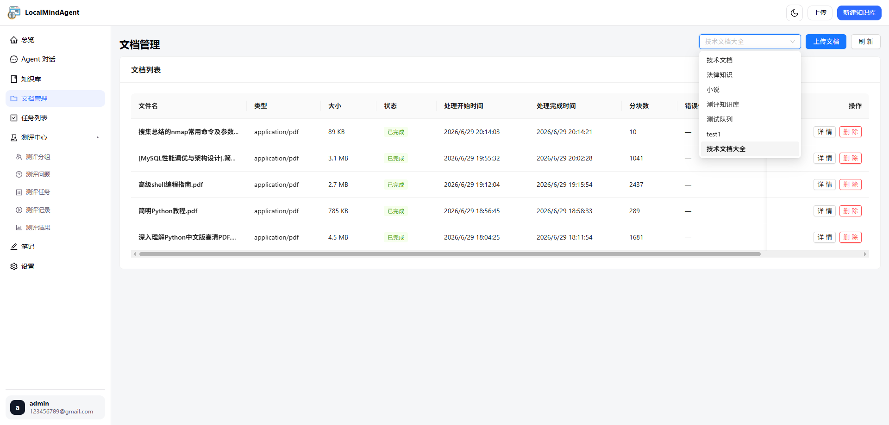 |

| 笔记管理 | 后台任务 |
|----------|----------|
| 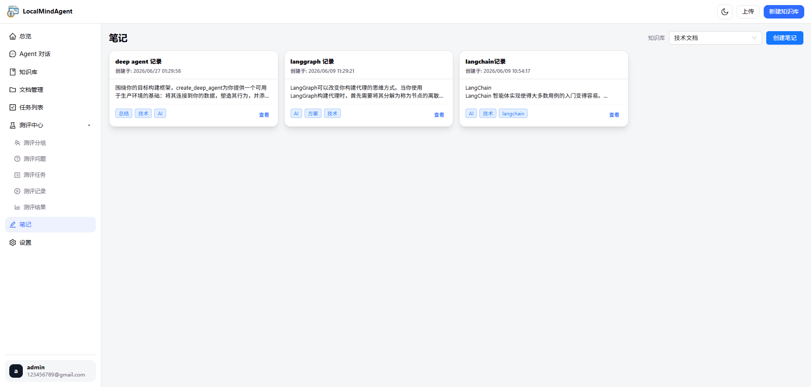 | 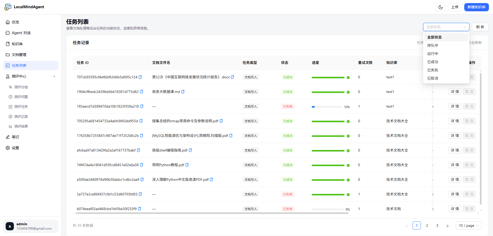 |

| 模型配置 |
|----------|
| 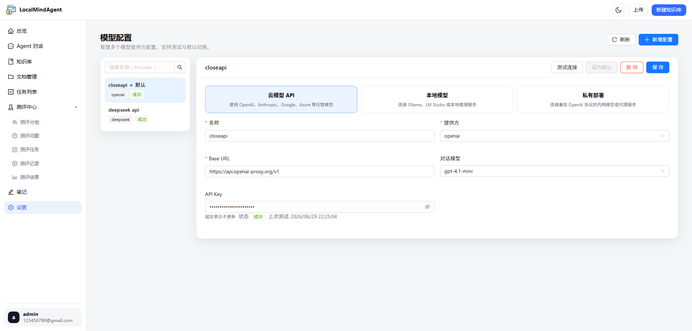 |

### RAG 评估中心

| 评估分组 | 评估问题 | 评估任务 |
|----------|----------|----------|
| 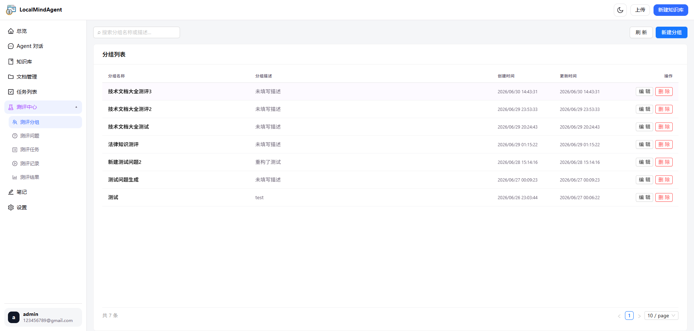 | 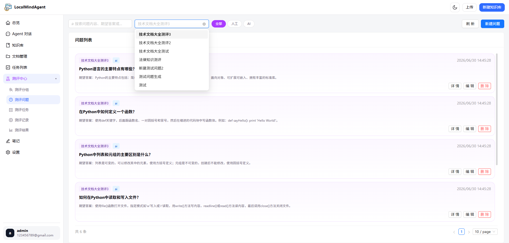 | 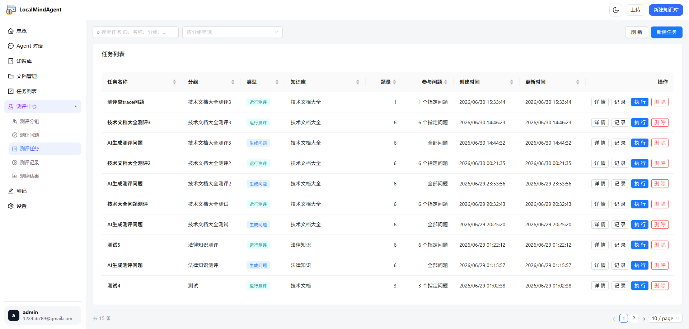 |

| 评估运行 | 评估结果 |
|----------|----------|
| 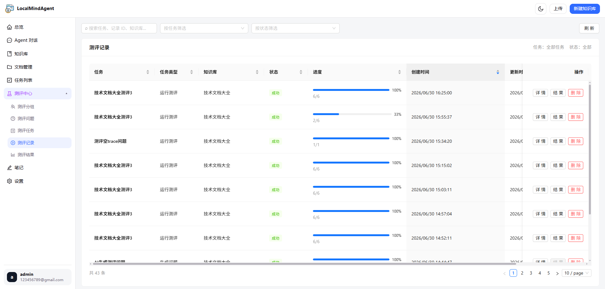 | 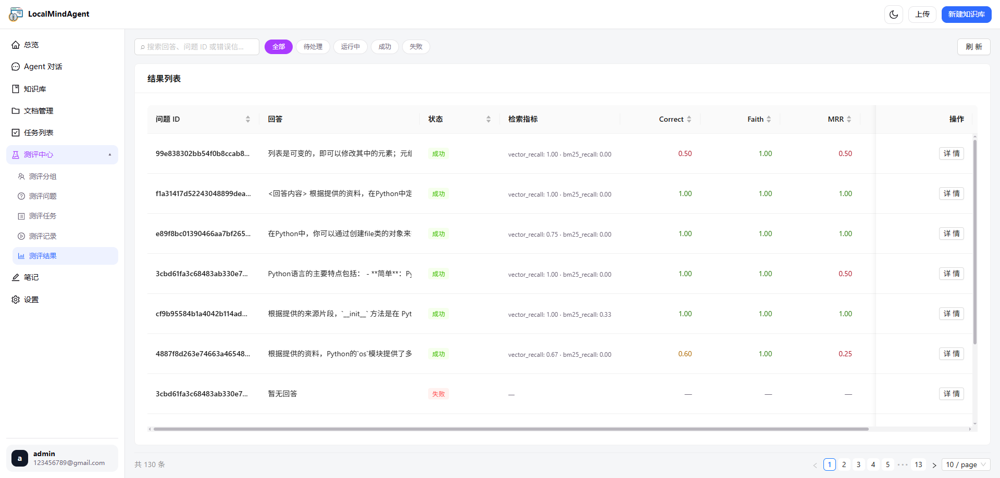 |

| 评估运行详情 | 评估结果详情 |
|--------------|--------------|
| 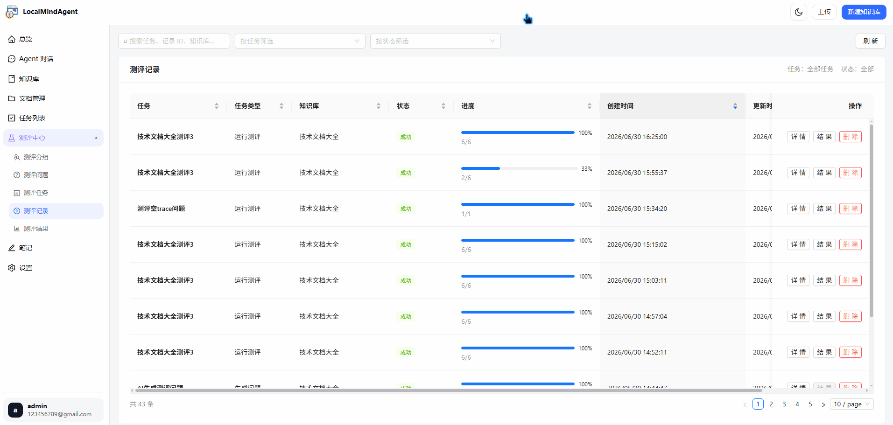 | 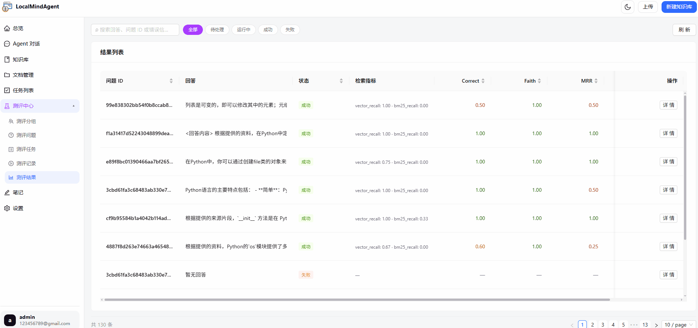 |

## 技术栈

| 类别 | 技术 | 版本 |
|------|------|------|
| 框架 | React | ^19.2 |
| 语言 | TypeScript | ~6.0 |
| 构建工具 | Vite | ^8.0 |
| UI 组件库 | Ant Design | ^6.4 |
| 图标 | @ant-design/icons | ^6.2 |
| 路由 | react-router-dom | ^7.17 |
| Markdown 渲染 | react-markdown + remark-gfm + rehype-highlight | |
| 代码高亮 | highlight.js | ^11.11 |
| 包管理器 | pnpm | |

## 项目结构

```
frontend/
├── public/                    # 静态资源
│   ├── brain.svg              # 网站图标
│   ├── favicon.svg            # 浏览器标签图标
│   └── logo.svg / logo.png    # Logo 资源
├── src/
│   ├── assets/                # 图片与图标资源
│   │   └── toast/             # Toast 通知图标
│   ├── components/            # 共享 UI 组件
│   │   ├── ThemeToggle/       # 亮色/暗色模式切换
│   │   └── Toast/             # Toast 通知系统（Context 驱动）
│   ├── context/               # React Context
│   │   ├── ThemeContext.tsx    # 主题管理（亮/暗 + localStorage 持久化）
│   │   └── AntdConfig.tsx     # Ant Design 主题配置桥接
│   ├── features/              # 按业务域组织的功能模块
│   │   ├── auth/              # 认证模块（登录、Token、用户）
│   │   ├── chat/              # 对话模块（SSE 流式、消息、会话管理）
│   │   ├── documents/         # 文档管理（上传、列表、CRUD）
│   │   ├── evaluation/        # RAG 评估系统（分组/问题/任务/运行/结果）
│   │   ├── knowledge-bases/   # 知识库 CRUD
│   │   ├── notes/             # 笔记管理
│   │   ├── overview/          # 仪表盘概览数据
│   │   ├── settings/          # 模型配置管理
│   │   └── tasks/             # 后台任务管理
│   ├── layouts/               # 布局组件
│   │   ├── WorkspaceLayout/   # 主工作区布局
│   │   ├── Sidebar/           # 左侧导航栏
│   │   ├── Topbar/            # 顶部操作栏
│   │   ├── ContextPanel/      # 右侧上下文面板（引用来源）
│   │   └── AgentComposer/     # 对话输入区域
│   ├── lib/                   # 工具库
│   │   ├── apiClient.ts       # API 客户端（fetch 封装、认证、错误处理）
│   │   ├── fileUpload.ts      # 文件上传工具
│   │   ├── sourceColor.ts     # 来源文件颜色生成
│   │   └── dateTime.ts        # 日期格式化工具
│   ├── pages/                 # 路由页面
│   │   ├── ChatPage/          # Agent 对话界面
│   │   ├── DashboardPage/     # 仪表盘/首页
│   │   ├── DocumentsPage/     # 文档管理
│   │   ├── Knowledge/         # 知识库管理
│   │   ├── Login/             # 登录页面
│   │   ├── NotesPage/         # 笔记管理
│   │   ├── SettingsPage/      # 模型配置
│   │   ├── TasksPage/         # 任务列表
│   │   ├── TaskDetailPage/    # 任务详情
│   │   ├── EvaluationPage/    # 评估中心
│   │   ├── NotFoundPage/      # 404 页面
│   │   └── RouteErrorPage/    # 路由错误页面
│   ├── router/                # 路由配置
│   │   ├── router.tsx         # 路由定义（含权限守卫）
│   │   └── nav.tsx            # 导航菜单结构
│   ├── styles/                # 全局样式
│   │   ├── tokens.css         # CSS 变量（亮/暗主题）
│   │   ├── globals.css        # 全局基础样式
│   │   └── ui.module.css      # 可复用 CSS 模块
│   ├── App.tsx                # 根组件
│   ├── main.tsx               # 应用入口
│   └── index.css              # 样式入口
├── index.html                 # HTML 模板
├── vite.config.ts             # Vite 配置
├── tsconfig.json              # TypeScript 配置
├── eslint.config.js           # ESLint 配置
├── .env                       # 环境变量
└── package.json               # 项目配置与依赖
```

## 功能概览

### 🔐 认证系统
- 邮箱/密码登录
- Token 本地持久化（localStorage）
- 路由权限守卫（RequireAuth），401 自动跳转登录页

### 📊 仪表盘
- 知识库统计概览：文档数、分块数、笔记数
- 最近文档及处理状态展示
- 最近笔记列表
- 快捷操作入口

### 💬 Agent 对话
- 基于知识库的智能问答
- SSE 流式响应，支持进度节点与时间线
- 消息引用来源展示
- 对话历史管理（新建、切换、删除）
- Markdown 渲染 + 代码语法高亮
- 消息内容一键复制

### 📚 知识库管理
- 知识库的创建、编辑、删除
- 分页列表，支持搜索
- 每个知识库独立管理文档和笔记

### 📄 文档管理
- 多格式文件上传（PDF、DOC、DOCX、TXT、MD/Markdown）
- 两阶段上传流程：文件服务器 → 知识库注册
- 处理状态实时跟踪（待处理 → 解析中 → 分块中 → 嵌入中 → 已完成/失败）
- 文档详情查看与删除

### 📝 笔记管理
- Markdown 笔记的创建与编辑
- 标签系统（建议标签 + 自定义标签）
- 按知识库筛选

### ⚙️ 后台任务
- 文档处理任务列表，支持状态过滤
- 任务进度展示
- 任务取消功能
- 任务详情（输入/输出 JSON 查看）

### 🧪 RAG 评估中心
- **分组**：评估问题的逻辑分组管理
- **问题**：带预期答案的评估问题管理
- **任务**：评估作业配置（选择分组、知识库、模型）
- **运行**：评估执行与实时状态跟踪
- **结果**：单项评估结果查看，含 recall、MRR、correctness、faithfulness 等指标

### 🔧 设置
- LLM 模型配置管理（CRUD）
- 支持多种提供商类型：
  - 云模型 API（OpenAI、Anthropic、DeepSeek）
  - 本地模型（Ollama）
  - 私有部署
- 模型连接测试
- 默认模型设置

### 🎨 主题系统
- 亮色 / 暗色模式切换
- CSS 变量驱动，平滑过渡
- 自动同步 Ant Design 组件主题
- 跨标签页主题同步

## 快速开始

### 环境要求

- Node.js >= 18
- pnpm >= 8

### 安装与运行

```bash
# 安装依赖
pnpm install

# 启动开发服务器
pnpm dev
```

开发服务器将在 `http://localhost:3000` 启动，API 请求自动代理到 `http://localhost:8000`。

### 构建

```bash
# 类型检查 + 生产构建
pnpm build

# 预览生产构建
pnpm preview
```

### 代码检查

```bash
pnpm lint
```

## 环境变量

在项目根目录创建 `.env` 文件：

```env
# API 基础地址
VITE_API_BASE_URL=http://10.215.211.99:8000/
```

| 变量名 | 说明 | 默认值 |
|--------|------|--------|
| `VITE_API_BASE_URL` | 后端 API 基础地址 | 开发时使用 Vite 代理（`/api` → `localhost:8000`） |

## API 代理

开发环境下，Vite 会将 `/api` 路径的请求代理转发到后端服务：

```typescript
// vite.config.ts
server: {
  port: 3000,
  proxy: {
    '/api': {
      target: 'http://localhost:8000',
      changeOrigin: true,
    },
  },
}
```

## 后端依赖

本项目需要配合 [LMindAgent 后端服务](https://github.com/LMindAgent) 使用，主要 API 端点：

| 模块 | 端点前缀 |
|------|----------|
| 认证 | `/api/v1/login` |
| 对话 | `/api/v1/conversations`, `/api/v1/chat/stream` |
| 知识库 | `/api/v1/knowledge-bases` |
| 文档 | `/api/v1/documents`, `/api/v1/files/upload` |
| 笔记 | `/api/v1/notes` |
| 任务 | `/api/v1/tasks` |
| 概览 | `/api/v1/overview` |
| 评估 | `/api/v1/evaluation/*` |
| 模型配置 | `/api/v1/model-configs` |

## 技术特性

- **纯 CSS 变量主题系统**：无第三方 CSS 框架依赖，通过 `tokens.css` 定义完整的亮/暗色设计令牌
- **CSS Modules**：组件级别样式隔离，`.module.css` 文件自动作用域
- **自定义 API 客户端**：统一的 fetch 封装，自动处理认证、错误、401 重定向
- **SSE 流式响应**：对话模块基于 Server-Sent Events 实现实时 AI 回复流式展示
- **TypeScript 严格模式**：`noUnusedLocals`、`noUnusedParameters`、`verbatimModuleSyntax` 全开
- **ESLint 扁平配置**：基于 ESLint 最新 flat config，集成 TypeScript 和 React Hooks 规则
- **Vite 极速构建**：基于 Oxc 的 React 插件，HMR 热更新

## 许可证

待定

---

**LMindAgent** — 让本地知识管理更智能。
